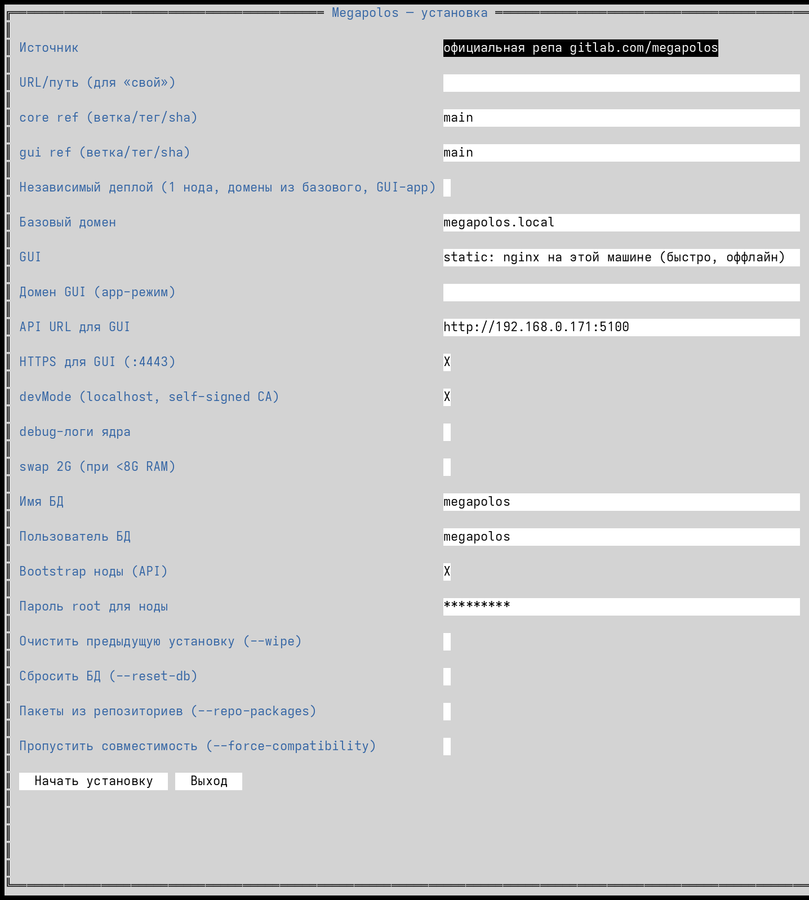

# megapolos-installer

Установщик Megapolos (megapolos-core + megapolos-gui) — один статический Go-бинарь
с TUI (tview) и headless-режимом. Работает онлайн (GitHub-релиз `slim-latest` или
gitlab-репо/кэши хоста) и полностью оффлайн (squashfs-бандл).

Оркестрация установки — нативная: установщик дёргает GraphQL ядра (нода → INIT →
PREPARE FOR CORE → INSTALL REGISTRY → сборка образа GUI → инстанс), без вызова
`ts-node install.ts`.

## Быстрый старт

Онлайн (релиз `slim-latest` на GitHub):

```bash
curl -fsSL https://raw.githubusercontent.com/AsmanovLev/megapolos-installer/main/install.sh | \
  sudo bash -s -- --standalone --base-domain=example.local
```

> Флаги передаются **только после `-s --`**. Лишний позиционный аргумент (например,
> имя бинаря `megapolos-installer`) недопустим: Go `flag` не разбирает флаги после
> первого не-флага, установщик завершится с ошибкой. Строковые флаги (`--swap`,
> `--self-node`) указывать через `=` (`--swap=true`), иначе съедят следующий аргумент.

Из смонтированного оффлайн-бандла:

```bash
sudo mount -o ro,loop megapolos-bundle.sqfs /mnt/megapolos-bundle
sudo /mnt/megapolos-bundle/installer                  # TUI
sudo /mnt/megapolos-bundle/installer --no-tui --yes   # headless
```

## Режимы

- TUI-визард (по умолчанию при наличии терминала): источник репо, ветки/коммиты,
  API URL, devMode, базовый домен, GUI on/off, standalone, self-node.
- Headless: всё через флаги (`megapolos-installer --help`), env `MEGAPOLOS_*`.
- Идемпотентен: повторный прогон пропускает сделанное (с причинами skip).
- При обнаружении существующей установки — интерактивный выбор:
  1) `--resume`, 2) поменять настройки и восстановить, 3) переустановить с нуля.
  Выбор «3» без переданных флагов открывает визард (с уже отмеченными `--wipe`
  и `--reset-db`).



## Ключевые флаги

- `--standalone` — независимый деплой: 1 нода, GUI как приложение платформы,
  домены из `--base-domain`, автоматически включает `--dev-mode` (self-signed
  Megapolos Root CA, certbot/Let's Encrypt не запускается).
- `--api-url=https://<host>:5104` — адрес API для GUI (попадает в
  `/config/config.json` как `MEGAPOLOS_SERVER`). Должен быть HTTPS и **покрыт
  сертификатом**. В standalone по умолчанию `https://<base-domain>:5104`.
- `--base-domain` — базовый домен (`gui.<base-domain>`, API `https://<base>:5104`).
- `--gui-domain`, `--gui`, `--gui-app`, `--gui-tls` — домен/режим GUI.
- `--wipe` — удалить предыдущую установку; `--reset-db` — дополнительно БД и роль.
  Полный сброс запомненных настроек — `sudo rm -rf /var/lib/megapolos`.
- `--resume` — долечить; `--retry-stage=<init|prepare-for-core|install-registry>` —
  повторить одну стадию.
- `--doctor` — диагностика; `--info` — последние ansible-логи.
- `--swap=auto|force|skip`, `--self-node=true|false|auto` — строковые, через `=`.
- `--yes --no-tui` — headless без вопросов.

Настройки прогона (включая секреты для восстановления) сохраняются в
`/var/lib/megapolos/installer.cfg` и подхватываются при `--resume`; явные
CLI-флаги имеют приоритет.

## Сертификаты и API

- В `--dev-mode` (и в `--standalone`) сертификаты подписывает единый Megapolos Root CA.
  Сертификат ноды на `:5104` покрывает `localhost`, `*.megapolos.localhost` и
  `127.0.0.1`; для реального домена нужен либо `api.megapolos.localhost`, либо
  домен, добавленный в SAN ноды.
- CA скачивается с ядра: `GET /api/ca/download`
  (`https://<api-host>:5104/api/ca/download` или без TLS-предупреждения —
  `http://<ip>:5100/api/ca/download`). Установщик печатает ссылку и пишет её в
  `/etc/motd`.
- Импорт CA в доверенные:
  - Debian/Ubuntu: `sudo cp megapolos-root-ca.crt /usr/local/share/ca-certificates/ && sudo update-ca-certificates`
  - RHEL/Fedora: `sudo cp megapolos-root-ca.crt /etc/pki/ca-trust/source/anchors/ && sudo update-ca-trust`
  - Windows: `certmgr.msc` → «Доверенные корневые центры сертификации» → Импорт.
  - macOS: Keychain Access → System → Always Trust.
  - Firefox хранит собственный стор сертификатов.

## Сборка

Go не нужен на хосте — сборка в контейнере (podman, fallback docker):

```bash
podman run --rm -v .:/src:Z -v ./vm/cache/gomod:/go/pkg/mod:Z -w /src \
  golang:1.24-bookworm bash -c 'CGO_ENABLED=0 go build -o megapolos-installer .'
```

Релизная сборка (amd64, stripped):

```bash
CGO_ENABLED=0 GOOS=linux GOARCH=amd64 go build -trimpath -ldflags="-s -w" \
  -o megapolos-installer .
```

Тесты: `CGO_ENABLED=0 go vet ./... && CGO_ENABLED=0 go test ./...`.

## Оффлайн-бандл (squashfs)

```bash
./vm/make-bundle.sh 2222          # из установленной VM (ssh-порт)
./vm/make-bundle-docker.sh        # из Dockerfile, без VM-донора
```

Получается `bundle/megapolos-bundle.sqfs` (~650M): debs, npm-кэши, git-репо,
дамп БД, node-gyp кэш, lock-файлы, сам бинарь.

## Тестовые VM (QEMU/KVM)

```bash
./vm/host-services.sh start       # http :8000 (зеркало), apt-cacher :3142, verdaccio :4873
./vm/create-vm.sh demo            # user-net (пробросы портов)
./vm/create-vm.sh lan --net bridge  # bridge в LAN (свой IP из DHCP)
./vm/vm.sh demo start|stop|ssh|reset|status|log
./vm/e2e.sh test2 --offline       # E2E: reset → install → ассерты
```

## Развёртывание в изолированном контуре (КИИ)

Бандл самодостаточен: платформа + деплой приложений без единого внешнего запроса.

1. Перенести `bundle/megapolos-bundle.sqfs` (~1G) на целевую машину.
2. Выполнить:
   ```bash
   sudo mount -o ro,loop megapolos-bundle.sqfs /mnt/megapolos-bundle
   sudo /mnt/megapolos-bundle/installer                 # TUI
   # или без вопросов:
   sudo /mnt/megapolos-bundle/installer --no-tui --yes --standalone --base-domain=<домен>
   ```
3. GUI: `https://gui.<домен>/`, API `https://<домен>:5104`, токен в
   `/root/megapolos-token.txt`.

Требования к целевой: **Ubuntu 22.04/24.04 amd64**, root, systemd.
- с GUI: ≥ 4 ГБ RAM, ≥ 15 ГБ диска;
- без GUI (`--gui=false`): ≥ 2 ГБ RAM, ≥ 10 ГБ.

После установки:
- **DNS**: wildcard-запись `*.<домен> → <ip>` во внутреннем DNS (или `/etc/hosts`
  на клиентах). Без DNS домены не резолвятся.
- **CA**: сертификаты self-signed от Megapolos Root CA — скачать (см. «Сертификаты
  и API») и импортировать в доверенные на клиентах.
- **Образы приложений**: базовые (`node:18`, `busybox:1.35`, `nginx`, `registry:2`)
  уже в бандле — сборка приложений в контуре работает.

## Структура

- `main.go`, `internal/` — Go-установщик (steps DAG-runner, tview TUI, sys exec)
- `vm/` — инфраструктура тестовых VM и хост-сервисов
- `bundle/` — Dockerfile и скрипты сборки бандла (артефакты в .gitignore)
- `install/` — bootstrap.sh (однострочник) + legacy bash-установщик (справочно)

Исходники core/gui ожидаются в соседнем каталоге `../megapolos/{megapolos-core,megapolos-gui}`
(нужны host-services для git-зеркала и make-bundle для бандла).

## Почему оркестрация нативная (GraphQL), а не вызов install.ts

Ранее bootstrap выполнял `ts-node install.ts` из megapolos-core. Сейчас установщик
повторяет ту же цепочку напрямую через GraphQL ядра (`internal/steps/bootstrap.go`):
нода (get-or-create) → `init` → `prepareForCore` → `installRegistry` → сборка образа
GUI (poll статуса) → `createConfiguratedInstance`.

1. **Node.js в системе всё равно обязателен** — ядро Node-приложение; экономии нет.
2. **Контракт GraphQL стабильнее внутренностей install.ts**: держим узкий набор
   мутаций/запросов, а не копию тысяч строк, которую upstream правит регулярно.
3. **Меньше расхождений в рантайме**: get-or-create, ожидание статусов ноды и
   сборки образа явно реализованы и логируются в Go.
4. Монолит оправдан там, где это наш код: детект пакетов, оффлайн-бандл,
   идемпотентность, TUI.
